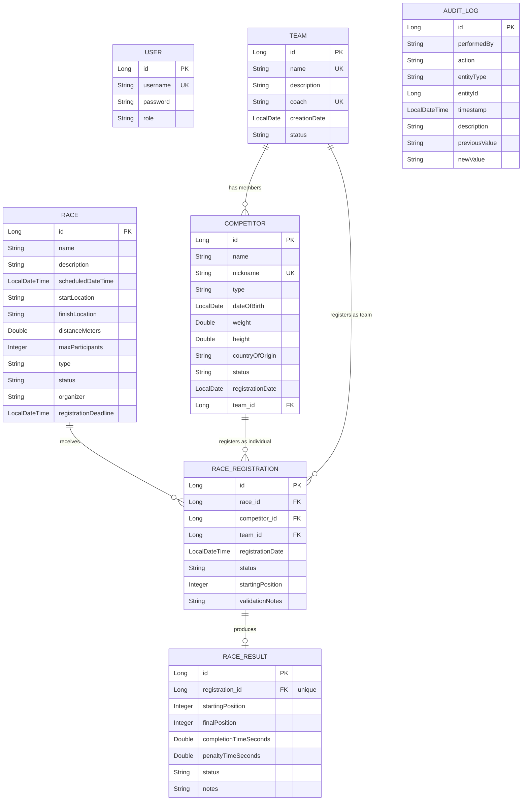

# The Great EIA Camel vs. Dwarf Racing System

A full-stack information system for managing the (fictional, gloriously absurd) EIA Camel vs. Dwarf Racing League — competitors, teams, races, registrations, results, standings, and a full audit trail, secured with JWT-based role authentication.

Built for the **Implementation and Integration of Software** course at Universidad EIA, under instructor Sebastián Zapata Ramírez.

## Team Members

- Lucas Henao ([@Lucashenao11](https://github.com/Lucashenao11))
- Álvaro Andrés David Prado
- Juan David Sepúlveda

## Table of Contents

- [Architecture](#architecture)
- [Tech Stack](#tech-stack)
- [Database Model](#database-model)
- [Security Strategy](#security-strategy)
- [User Roles & Permissions](#user-roles--permissions)
- [Getting Started](#getting-started)
- [Environment Variables](#environment-variables)
- [URLs & Ports](#urls--ports)
- [Testing](#testing)
- [Sample Users](#sample-users)
- [Sample API Requests](#sample-api-requests)
- [Known Limitations](#known-limitations)
- [Future Improvements](#future-improvements)

## Architecture

The system follows a decoupled client-server architecture with a layered backend:

```
frontend/          Angular 20 SPA (standalone components)
backend/            Spring Boot 4 REST API
  ├── controller/    Receives HTTP requests, delegates to services, returns HTTP responses
  ├── service/        Business rules, validation, orchestration across repositories
  ├── repository/    Spring Data JPA interfaces — data access only
  ├── model/          JPA entities and enums
  ├── dto/            Request/response contracts — entities are never exposed directly
  ├── security/       JWT generation/validation, auth filter, user details service
  ├── exception/      Custom exceptions + a global handler producing structured JSON errors
  └── config/         Security, CORS, and data-seeding configuration
```

The frontend communicates with the backend exclusively through the REST API (never touches the database directly), and authenticates via a JWT attached automatically to every request by an HTTP interceptor.

## Tech Stack

| Layer | Technology |
|---|---|
| Backend | Java 21, Spring Boot 4.0.8 (Web, Data JPA, Security, Validation), Maven |
| Database | PostgreSQL 16 |
| Auth | JWT (jjwt 0.12.6), BCrypt password hashing |
| Frontend | Angular 20 (standalone components, signals, functional guards/interceptors) |
| Containerization | Docker, Docker Compose (multi-stage builds, Nginx for frontend serving) |

## Database Model

Entities: `User`, `Competitor`, `Team`, `Race`, `RaceRegistration`, `RaceResult`, `AuditLog`.



Notes on the model:
- A `RaceRegistration` belongs to **either** a `Competitor` **or** a `Team`, never both — enforced in the service layer rather than the schema (two nullable foreign keys, with an "exactly one" business rule).
- Standings are **computed on demand** from `RaceResult` rows (per the spec's points table), never stored — avoiding a second source of truth that could drift out of sync.
- All enum-backed columns (`status`, `type`, `role`, etc.) are stored as their string name (`EnumType.STRING`), not their ordinal position, so reordering an enum's values never silently corrupts existing data.

## Security Strategy

- **Password storage:** BCrypt hashing (one-way; never reversible, never stored in plaintext).
- **Authentication:** stateless JWT (HS256). On login, the server issues a signed token containing the username and role; every subsequent request carries it in an `Authorization: Bearer <token>` header, validated by a custom filter before reaching any controller.
- **Authorization:** role-based, enforced centrally in `SecurityConfig`'s filter chain — not scattered across individual controllers.
- **Error handling:** a global exception handler ensures no endpoint — business logic, malformed requests, unmatched URLs, or bad credentials — ever leaks a raw stack trace. All errors return the structured shape:
  ```json
  { "timestamp": "...", "status": 404, "error": "Not Found", "message": "...", "path": "..." }
  ```
- **Secrets:** the JWT signing secret and database credentials are injected via environment variables (see [Environment Variables](#environment-variables)) — never hardcoded, never committed.
- **CORS:** restricted to the known frontend origin(s) via an explicit `CorsConfigurationSource`, not a wildcard.

## User Roles & Permissions

| Role | Competitors / Teams | Races / Registrations / Results | Standings | Audit Log |
|---|---|---|---|---|
| **ADMINISTRATOR** | Full manage | Full manage | Read | Read |
| **RACE_ORGANIZER** | Read only | Full manage | Read | — |
| **VIEWER** | — | Read races/results only | Read | — |

Self-registration via `/api/auth/register` always creates a `VIEWER` account. Administrator and Race Organizer accounts are seeded automatically on first startup (see [Sample Users](#sample-users)).

## Getting Started

### Prerequisites

- Docker Desktop (running)
- Git

### Run the full stack

```bash
git clone https://github.com/Lucashenao11/eia-camel-dwarf-racing.git
cd eia-camel-dwarf-racing
cp .env.example .env   # then edit .env and set a real JWT_SECRET
docker compose up -d --build
```

That's it — backend, frontend, and PostgreSQL all start together, correctly networked and health-checked.

- Frontend: [http://localhost:4200](http://localhost:4200)
- Backend API: [http://localhost:8080/api](http://localhost:8080/api)

Stop everything with `docker compose down` (add `-v` to also wipe the database volume).

### Running components individually (local development, no Docker)

**Backend:**
```bash
cd backend
./mvnw spring-boot:run
```
Requires a local PostgreSQL instance matching the defaults in `application.yml` (`localhost:5432`, db `camel_dwarf_racing`, user `race_admin` / password `race_password`), or override via environment variables.

**Frontend:**
```bash
cd frontend
npm install
ng serve
```
Serves at `http://localhost:4200`, pointed at `http://localhost:8080/api` per `src/environments/environment.ts`.

## Environment Variables

Set in `.env` at the repo root (see `.env.example` for a template — never commit real secrets):

| Variable | Purpose | Default (local dev) |
|---|---|---|
| `DB_HOST` | Postgres host | `localhost` |
| `DB_PORT` | Postgres port | `5432` |
| `DB_NAME` | Database name | `camel_dwarf_racing` |
| `DB_USERNAME` | Database user | `race_admin` |
| `DB_PASSWORD` | Database password | `race_password` |
| `JWT_SECRET` | JWT signing key (256+ bits) | *(must be set — no safe default)* |
| `JWT_EXPIRATION` | Token lifetime, ms | `3600000` (1 hour) |
| `CORS_ALLOWED_ORIGINS` | Allowed frontend origin(s) | `http://localhost:4200` |
| `TEAM_MAX_MEMBERS` | Configurable team roster cap | `5` |

## URLs & Ports

| Service | URL | Container Port | Host Port |
|---|---|---|---|
| Frontend (Angular via Nginx) | http://localhost:4200 | 80 | 4200 |
| Backend (Spring Boot API) | http://localhost:8080/api | 8080 | 8080 |
| PostgreSQL | — | 5432 | 5432 |

## Testing

Backend automated tests live in `backend/src/test/java`. Run with:
```bash
cd backend
./mvnw test
```
Covers: entity validation, service-layer business rules (uniqueness, eligibility, state transitions), controller request/response contracts, and security/authorization boundaries.

## Sample Users

Seeded automatically on first backend startup (`DataSeeder`):

| Username | Password | Role |
|---|---|---|
| `admin` | `admin123` | ADMINISTRATOR |
| `organizer` | `organizer123` | RACE_ORGANIZER |
| `viewer` | `viewer123` | VIEWER |

*(Change these before any real deployment — they exist purely for grading/demo convenience.)*

## Sample API Requests

**Login:**
```bash
curl -X POST http://localhost:8080/api/auth/login \
  -H "Content-Type: application/json" \
  -d '{"username": "admin", "password": "admin123"}'
```

**Create a competitor (requires ADMINISTRATOR token):**
```bash
curl -X POST http://localhost:8080/api/competitors \
  -H "Content-Type: application/json" \
  -H "Authorization: Bearer <token>" \
  -d '{
    "name": "Byte", "nickname": "Byte the Camel", "type": "CAMEL",
    "dateOfBirth": "2019-05-10", "weight": 480.5, "height": 210.0,
    "countryOfOrigin": "Colombia"
  }'
```

**Get overall standings (any authenticated role):**
```bash
curl http://localhost:8080/api/standings -H "Authorization: Bearer <token>"
```

A full Postman collection covering every endpoint is included at `docs/postman_collection.json` — import it directly into Postman and set the `baseUrl` and `token` collection variables.

## Known Limitations

- `DELETE` on `Competitor` and `Team` is currently a hard delete; the spec's rule that entities with official race history must be deactivated instead is flagged with `TODO`s pending full lifecycle wiring.
- No refresh-token flow — tokens simply expire after `JWT_EXPIRATION` and require a fresh login.
- No rate limiting on authentication endpoints.

## Future Improvements

- Soft-delete / deactivation for Competitors and Teams with race history, per the spec's business rules.
- Refresh tokens for a smoother session experience.
- Flyway/Liquibase migrations in place of `ddl-auto: update` for safer schema evolution.
- CI pipeline (GitHub Actions) running tests and building Docker images on every push.
